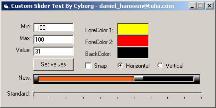



## Enhanced Slider Ocx Source

### Description

This is a great slider that can be used just as the original by MS in any application.

It looks much better and has more features!
 
### More Info
 
There is a ForeColor and a ForeColor2 input for a nice gradient effect. You can set it to Horizontal/Vertical view. You can use snap or smooth scrolling. You can set Min/Max and Value. You can also set the BackColor.

This can be compiled as an Ocx file that can be used in any application, or it can be added as it is in the original code to any VB project!

The Ocx will return the Value, as in the original slider by MS.

             |
---                |---
**Submitted On**   |2003-04-05 11:19:44
**By**             |[Daniel Hansson](https://github.com/Planet-Source-Code/PSCIndex/blob/master/ByAuthor/daniel-hansson.md)
**Level**          |Intermediate
**User Rating**    |5.0 (25 globes from 5 users)
**Compatibility**  |VB 4\.0 \(32\-bit\), VB 5\.0, VB 6\.0
**Category**       |[Custom Controls/ Forms/  Menus](https://github.com/Planet-Source-Code/PSCIndex/blob/master/ByCategory/custom-controls-forms-menus__1-4.md)
**World**          |[Visual Basic](https://github.com/Planet-Source-Code/PSCIndex/blob/master/ByWorld/visual-basic.md)
**Archive File**   |[Enhanced\_S158263532003\.zip](https://github.com/Planet-Source-Code/daniel-hansson-enhanced-slider-ocx-source__1-45210/archive/master.zip)

